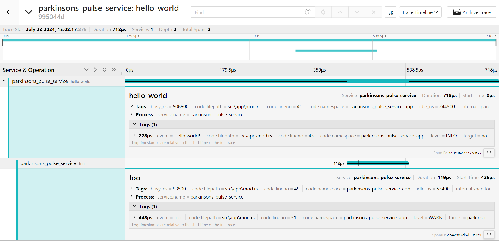
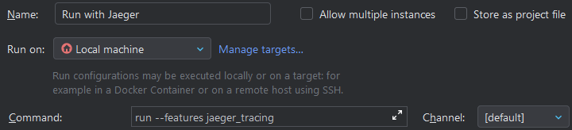

# Parkinson's Pulse Service
The Backend service for Parkinson's Pulse, based on Rust and Axum and using a MongoDB database
(For a full list of dependencies and their versions, refer to `Cargo.toml`)

# Run locally
To run this locally, use the following steps:
```bash
git clone https://github.com/BigLNotation/parkinsons_pulse_service.git
cd parkinsons_pulse_service
docker compose up -d
cp .env.example .env
cargo run
```

### Notes:
This will not have any data in it unless you spec out a volume for the container. 
To access the server that has now been started the url will be `localhost:4444/`. 

# Configurations
## ENV
(See `.env.example` for example values)
- `API_PORT` specifies the port that this app will serve on.
- `DATABASE_URL` specifies the URL (including port) for the MongoDB database.
- `ORIGIN_DOMAIN` specifies the CORS allowed origin (i.e. in production it should be set to the URL of the frontend website).
- `JWT_SECRET` specifies the secret used when generating and validating JWTs (used for authentication).

# Tracing
## Jaeger
This service allows for local use of jaeger for tracing. 

To enable this feature please follow the following steps.

- Run Jaeger `docker run -d -p6831:6831/udp -p6832:6832/udp -p16686:16686 -p14268:14268 jaegertracing/all-in-one:latest`
- Run with jaeger tracing feature enabled `cargo run --features jaeger_tracing`
- Open Jaeger `http://localhost:16686/`

If you are using JetBrains you can create a profile to auto run this feature:

